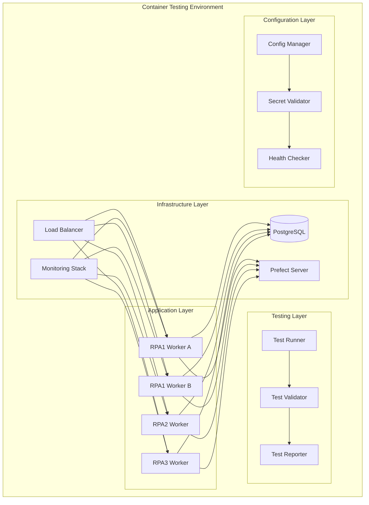
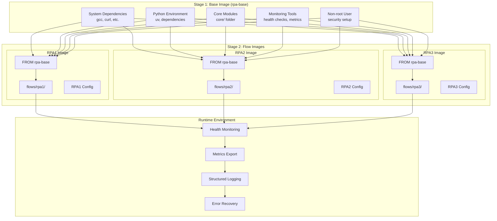

# Container Testing System Design

## Overview

This design creates a robust, production-ready container testing system for the distributed processing framework. The system will provide comprehensive testing capabilities for distributed workflows while maintaining development velocity and operational simplicity. The design focuses on proper environment configuration management, reliable service orchestration, comprehensive health monitoring, and automated validation capabilities.

## Architecture

### High-Level Architecture



### Container Architecture - Two-Stage Build Process

The container system uses a two-stage build process to optimize build performance and enable rapid iteration:

**Stage 1: Base Image** - Contains stable, infrequently changing components
**Stage 2: Flow Images** - Lightweight images built from base image with flow-specific code



#### Build Process Benefits

1. **Base Image Stability** - Built once, reused by all flows
2. **Fast Flow Builds** - Only copy flow code, no dependency installation
3. **Development Efficiency** - Code changes only require flow image rebuild
4. **Cache Optimization** - Docker layer caching maximizes build speed
5. **Consistent Environment** - All flows use identical base environment

## Components and Interfaces

### 1. Enhanced Configuration Management

#### ConfigurationValidator

```python
class ConfigurationValidator:
    """Validates container configuration before startup"""

    def validate_environment_variables(self) -> ValidationResult
    def validate_database_connections(self) -> ValidationResult
    def validate_service_dependencies(self) -> ValidationResult
    def generate_startup_report(self) -> StartupReport
```

#### ContainerConfigManager

```python
class ContainerConfigManager(ConfigManager):
    """Extended configuration manager for container environments"""

    def load_container_config(self) -> ContainerConfig
    def validate_container_environment(self) -> bool
    def wait_for_dependencies(self, timeout: int) -> bool
    def setup_health_monitoring(self) -> HealthMonitor
```

### 2. Service Orchestration and Health Management

#### ServiceOrchestrator

```python
class ServiceOrchestrator:
    """Manages service startup, dependencies, and health"""

    def wait_for_database(self, timeout: int) -> bool
    def wait_for_prefect_server(self, timeout: int) -> bool
    def validate_service_health(self) -> ServiceHealthStatus
    def handle_service_failure(self, service: str, error: Exception) -> None
```

#### HealthMonitor

```python
class HealthMonitor:
    """Comprehensive health monitoring for containers"""

    def check_database_health(self) -> HealthStatus
    def check_application_health(self) -> HealthStatus
    def check_resource_usage(self) -> ResourceStatus
    def export_health_metrics(self) -> Dict[str, Any]
```

### 3. Automated Test Framework

#### ContainerTestSuite

```python
class ContainerTestSuite:
    """Comprehensive container testing framework"""

    def run_distributed_processing_tests(self) -> TestResults
    def run_performance_tests(self) -> PerformanceResults
    def run_fault_tolerance_tests(self) -> FaultToleranceResults
    def run_security_tests(self) -> SecurityResults
```

#### TestValidator

```python
class TestValidator:
    """Validates test results and generates reports"""

    def validate_no_duplicate_processing(self) -> ValidationResult
    def validate_performance_metrics(self) -> PerformanceValidation
    def validate_error_handling(self) -> ErrorHandlingValidation
    def generate_test_report(self) -> TestReport
```

### 4. Development Workflow Support

#### DevelopmentOrchestrator

```python
class DevelopmentOrchestrator:
    """Optimizes development workflow and iteration speed"""

    def detect_code_changes(self) -> List[str]
    def rebuild_affected_containers(self, changes: List[str]) -> bool
    def setup_hot_reloading(self) -> HotReloadConfig
    def provide_debugging_access(self) -> DebugConfig
```

## Data Models

### Configuration Models

```python
@dataclass
class ContainerConfig:
    """Container configuration with validation"""
    environment: str
    flow_name: str
    database_connections: Dict[str, DatabaseConfig]
    service_dependencies: List[ServiceDependency]
    resource_limits: ResourceLimits
    health_check_config: HealthCheckConfig
    monitoring_config: MonitoringConfig

@dataclass
class DatabaseConfig:
    """Database connection configuration"""
    connection_string: str
    connection_pool_size: int
    connection_timeout: int
    health_check_query: str
    retry_config: RetryConfig

@dataclass
class ServiceDependency:
    """Service dependency configuration"""
    service_name: str
    health_endpoint: str
    timeout: int
    retry_attempts: int
    required: bool
```

### Health and Monitoring Models

```python
@dataclass
class HealthStatus:
    """Health status information"""
    status: Literal["healthy", "degraded", "unhealthy"]
    message: str
    details: Dict[str, Any]
    timestamp: datetime
    check_duration: float

@dataclass
class ResourceStatus:
    """Resource usage status"""
    cpu_usage_percent: float
    memory_usage_mb: float
    memory_limit_mb: float
    disk_usage_mb: float
    network_connections: int
```

### Test Models

```python
@dataclass
class TestResults:
    """Test execution results"""
    test_name: str
    status: Literal["passed", "failed", "skipped"]
    duration: float
    details: Dict[str, Any]
    errors: List[str]
    warnings: List[str]

@dataclass
class PerformanceMetrics:
    """Performance test metrics"""
    records_processed: int
    processing_rate: float
    average_latency: float
    error_rate: float
    resource_efficiency: float
```

## Error Handling

### Error Categories and Responses

1. **Configuration Errors**

   - Missing environment variables → Fail fast with detailed error message
   - Invalid configuration values → Validate and provide correction suggestions
   - Database connection failures → Retry with exponential backoff

2. **Service Dependency Errors**

   - Database unavailable → Queue operations locally, retry connection
   - Prefect server unavailable → Continue processing, sync when available
   - Network partitions → Implement circuit breaker pattern

3. **Runtime Errors**
   - Container crashes → Automatic restart with state recovery
   - Resource exhaustion → Implement backpressure and alerting
   - Processing errors → Isolate failures, continue with other records

### Error Recovery Strategies

```python
class ErrorRecoveryManager:
    """Manages error recovery strategies"""

    def handle_configuration_error(self, error: ConfigError) -> RecoveryAction
    def handle_service_error(self, error: ServiceError) -> RecoveryAction
    def handle_runtime_error(self, error: RuntimeError) -> RecoveryAction
    def implement_circuit_breaker(self, service: str) -> CircuitBreaker
```

## Testing Strategy

### Test Categories

1. **Unit Tests**

   - Configuration validation logic
   - Health check implementations
   - Error handling mechanisms
   - Service orchestration logic

2. **Integration Tests**

   - Container startup and configuration
   - Service dependency management
   - Database connectivity and operations
   - Inter-container communication

3. **System Tests**

   - End-to-end distributed processing
   - Performance under load
   - Fault tolerance and recovery
   - Security and isolation

4. **Chaos Tests**
   - Random container failures
   - Network partitions
   - Resource exhaustion
   - Database failures

### Test Automation Framework

```python
class AutomatedTestFramework:
    """Automated testing framework for containers"""

    def setup_test_environment(self) -> TestEnvironment
    def run_test_suite(self, suite: TestSuite) -> TestResults
    def cleanup_test_environment(self) -> None
    def generate_test_reports(self) -> List[TestReport]
```

## Security Considerations

### Container Security

1. **Image Security**

   - Use minimal base images
   - Regular security scanning
   - Dependency vulnerability management
   - Multi-stage builds for reduced attack surface

2. **Runtime Security**

   - Non-root user execution
   - Read-only file systems where possible
   - Resource limits and quotas
   - Network segmentation

3. **Secret Management**
   - Secure secret injection
   - Rotation capabilities
   - Audit logging
   - Encryption at rest and in transit

### Security Validation

```python
class SecurityValidator:
    """Validates container security configuration"""

    def validate_user_permissions(self) -> SecurityResult
    def validate_network_policies(self) -> SecurityResult
    def validate_secret_management(self) -> SecurityResult
    def scan_for_vulnerabilities(self) -> VulnerabilityReport
```

## Performance Optimization

### Resource Management

1. **Memory Management**

   - Connection pooling
   - Efficient data structures
   - Garbage collection tuning
   - Memory leak detection

2. **CPU Optimization**

   - Async processing where appropriate
   - Efficient algorithms
   - Load balancing
   - CPU affinity settings

3. **I/O Optimization**
   - Batch operations
   - Connection reuse
   - Efficient serialization
   - Disk I/O minimization

### Performance Monitoring

```python
class PerformanceMonitor:
    """Monitors and optimizes container performance"""

    def monitor_resource_usage(self) -> ResourceMetrics
    def detect_performance_bottlenecks(self) -> List[Bottleneck]
    def optimize_resource_allocation(self) -> OptimizationResult
    def generate_performance_report(self) -> PerformanceReport
```

## Deployment and Operations

### Container Lifecycle Management

1. **Two-Stage Build Process**

   - **Stage 1 (Base Image)**: System dependencies, Python environment, core modules, monitoring tools
   - **Stage 2 (Flow Images)**: Flow-specific code built FROM base image for rapid iteration
   - Layer caching optimization for fast rebuilds (base image cached, only flow code changes)
   - Automated security scanning at both stages
   - Version tagging and management for base and flow images

2. **Deployment Process**

   - Rolling deployments
   - Health check validation
   - Rollback capabilities
   - Configuration validation

3. **Runtime Management**
   - Auto-scaling based on load
   - Health monitoring and alerting
   - Log aggregation and analysis
   - Performance optimization

### Operational Tools

```python
class OperationalManager:
    """Manages container operations and maintenance"""

    def deploy_containers(self, config: DeploymentConfig) -> DeploymentResult
    def scale_containers(self, scaling_policy: ScalingPolicy) -> ScalingResult
    def monitor_operations(self) -> OperationalMetrics
    def handle_incidents(self, incident: Incident) -> IncidentResponse
```

This design provides a comprehensive container testing system with:

1. **Robust Configuration Management** - Proper validation and error handling for environment variables and service dependencies
2. **Reliable Service Orchestration** - Systematic approach to service startup, health monitoring, and failure recovery
3. **Comprehensive Testing Framework** - Automated validation of distributed processing, performance, and fault tolerance
4. **Development Workflow Optimization** - Fast iteration cycles with hot reloading and efficient rebuilds
5. **Production Readiness** - Security, monitoring, and operational capabilities for production deployment
6. **Performance Optimization** - Resource management and performance monitoring for efficient operation
