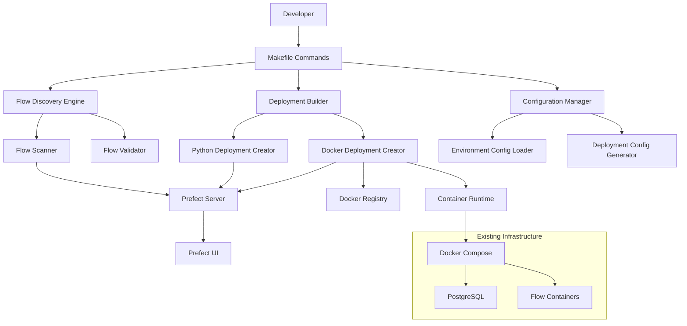

# Design Document

## Overview

The Prefect Deployment System will provide a comprehensive, automated solution for discovering, building, and deploying Prefect flows in both Python and containerized environments. The system will integrate with the existing repository structure and enhance the current Makefile-based workflow with intelligent flow discovery, robust deployment management, and clear developer guidance.

## Architecture

### Core Components

1. **Flow Discovery Engine**: Automatically scans the repository for Prefect flows and validates their structure
2. **Deployment Builder**: Creates both Python and Docker-based deployments with environment-specific configurations
3. **Makefile Integration**: Provides simple commands that orchestrate the entire deployment lifecycle
4. **Configuration Manager**: Handles environment-specific settings and deployment parameters
5. **Validation System**: Ensures flows, dependencies, and Docker images are ready for deployment
6. **Documentation Generator**: Creates and maintains developer guides and troubleshooting documentation

### System Architecture Diagram



## Components and Interfaces

### 1. Flow Discovery Engine

**Purpose**: Automatically discover and validate Prefect flows across the repository

**Key Classes**:

- `FlowDiscovery`: Main discovery orchestrator
- `FlowScanner`: Scans directories for Python files containing flows
- `FlowValidator`: Validates flow structure and dependencies
- `FlowMetadata`: Stores flow information and configuration

**Interfaces**:

```python
class FlowDiscovery:
    def discover_flows(self, base_path: str = "flows") -> List[FlowMetadata]
    def validate_flow(self, flow_path: str) -> ValidationResult
    def get_flow_dependencies(self, flow_path: str) -> List[str]

class FlowMetadata:
    name: str
    path: str
    module_path: str
    function_name: str
    dependencies: List[str]
    dockerfile_path: Optional[str]
    env_files: List[str]
    is_valid: bool
    validation_errors: List[str]
```

### 2. Deployment Builder

**Purpose**: Create and manage both Python and Docker deployments

**Key Classes**:

- `DeploymentBuilder`: Main deployment orchestrator
- `PythonDeploymentCreator`: Creates native Python deployments
- `DockerDeploymentCreator`: Creates containerized deployments
- `DeploymentConfig`: Manages deployment configuration

**Interfaces**:

```python
class DeploymentBuilder:
    def create_python_deployment(self, flow: FlowMetadata, env: str) -> Deployment
    def create_docker_deployment(self, flow: FlowMetadata, env: str) -> Deployment
    def deploy_all(self, deployment_type: str, environment: str) -> DeploymentResult
    def cleanup_deployments(self, pattern: str = None) -> CleanupResult

class DeploymentConfig:
    flow_name: str
    deployment_name: str
    environment: str
    work_pool: str
    schedule: Optional[str]
    parameters: Dict[str, Any]
    job_variables: Dict[str, Any]
```

### 3. Configuration Manager

**Purpose**: Handle environment-specific configurations and deployment parameters

**Key Classes**:

- `ConfigurationManager`: Main configuration orchestrator
- `EnvironmentConfig`: Environment-specific settings
- `DeploymentTemplate`: Template for deployment configurations

**Interfaces**:

```python
class ConfigurationManager:
    def load_environment_config(self, env: str) -> EnvironmentConfig
    def generate_deployment_config(self, flow: FlowMetadata, env: str) -> DeploymentConfig
    def validate_configuration(self, config: DeploymentConfig) -> ValidationResult

class EnvironmentConfig:
    name: str
    prefect_api_url: str
    work_pools: Dict[str, WorkPoolConfig]
    default_parameters: Dict[str, Any]
    resource_limits: ResourceLimits
```

### 4. Makefile Integration

**Enhanced Makefile Commands**:

```makefile
# Flow Discovery
discover-flows          # Scan and list all available flows
validate-flows          # Validate all discovered flows

# Deployment Management
build-deployments       # Create both Python and container deployments
deploy-python          # Deploy all Python-based deployments
deploy-containers      # Deploy all container-based deployments
deploy-all             # Deploy both Python and container deployments
clean-deployments      # Remove all existing deployments

# Environment-specific deployments
deploy-dev             # Deploy to development environment
deploy-staging         # Deploy to staging environment
deploy-prod            # Deploy to production environment

# Validation and Testing
validate-deployments   # Validate deployment configurations
test-deployments      # Test deployments without applying them
check-ui              # Verify deployments appear in Prefect UI

# Docker Management
build-images          # Build all Docker images for flows
push-images           # Push images to registry
pull-images           # Pull images from registry
```

## Data Models

### Flow Metadata Model

```python
@dataclass
class FlowMetadata:
    name: str                    # Flow name from @flow decorator
    path: str                   # Absolute path to flow file
    module_path: str            # Python module path (e.g., flows.rpa1.workflow)
    function_name: str          # Flow function name
    dependencies: List[str]     # Python dependencies
    dockerfile_path: Optional[str]  # Path to Dockerfile if exists
    env_files: List[str]       # Environment files (.env.*)
    is_valid: bool             # Validation status
    validation_errors: List[str]  # Validation error messages
    metadata: Dict[str, Any]   # Additional metadata from flow decorator
```

### Deployment Configuration Model

```python
@dataclass
class DeploymentConfig:
    flow_name: str
    deployment_name: str
    environment: str
    deployment_type: str        # "python" or "docker"
    work_pool: str
    schedule: Optional[str]
    parameters: Dict[str, Any]
    job_variables: Dict[str, Any]
    tags: List[str]
    description: str
    version: str
```

### Environment Configuration Model

```python
@dataclass
class EnvironmentConfig:
    name: str
    prefect_api_url: str
    work_pools: Dict[str, WorkPoolConfig]
    default_parameters: Dict[str, Any]
    resource_limits: ResourceLimits
    docker_registry: Optional[str]
    image_pull_policy: str
```

## Error Handling

### Validation Errors

- **Flow Structure Errors**: Missing @flow decorator, invalid function signature
- **Dependency Errors**: Missing Python packages, version conflicts
- **Docker Errors**: Missing Dockerfile, build failures, image not found
- **Configuration Errors**: Invalid environment settings, missing work pools

### Error Recovery Strategies

1. **Graceful Degradation**: Skip invalid flows and continue with valid ones
2. **Detailed Logging**: Provide specific error messages with remediation steps
3. **Rollback Capability**: Ability to revert to previous deployment state
4. **Retry Logic**: Automatic retry for transient failures (network, API timeouts)

### Error Reporting

```python
@dataclass
class ValidationResult:
    is_valid: bool
    errors: List[ValidationError]
    warnings: List[ValidationWarning]

@dataclass
class ValidationError:
    code: str
    message: str
    file_path: Optional[str]
    line_number: Optional[int]
    remediation: str
```

## Testing Strategy

### Unit Tests

- Flow discovery logic
- Deployment configuration generation
- Validation functions
- Configuration management

### Integration Tests

- End-to-end deployment creation
- Prefect API integration
- Docker image building and deployment
- Environment configuration loading

### System Tests

- Full deployment workflow from discovery to UI verification
- Multi-environment deployment scenarios
- Error handling and recovery scenarios
- Performance testing with multiple flows

### Test Structure

```
tests/
├── unit/
│   ├── test_flow_discovery.py
│   ├── test_deployment_builder.py
│   ├── test_configuration_manager.py
│   └── test_validation.py
├── integration/
│   ├── test_deployment_workflow.py
│   ├── test_prefect_integration.py
│   └── test_docker_integration.py
└── system/
    ├── test_end_to_end_deployment.py
    ├── test_multi_environment.py
    └── test_error_scenarios.py
```

## Implementation Architecture

### Directory Structure

```
deployment_system/
├── __init__.py
├── discovery/
│   ├── __init__.py
│   ├── flow_scanner.py
│   ├── flow_validator.py
│   └── metadata.py
├── builders/
│   ├── __init__.py
│   ├── base_builder.py
│   ├── python_builder.py
│   └── docker_builder.py
├── config/
│   ├── __init__.py
│   ├── manager.py
│   ├── environments.py
│   └── templates.py
├── validation/
│   ├── __init__.py
│   ├── flow_validator.py
│   ├── deployment_validator.py
│   └── docker_validator.py
└── cli/
    ├── __init__.py
    ├── commands.py
    └── utils.py
```

### Integration Points

1. **Existing Makefile**: Enhance current commands and add new deployment-specific commands
2. **Docker Compose**: Integrate with existing container infrastructure
3. **Prefect Configuration**: Work with existing prefect.yaml and environment configurations
4. **Flow Structure**: Support existing flow patterns and directory structure
5. **Environment Management**: Integrate with existing environment configuration system

### Configuration Files

**deployment_config.yaml**:

```yaml
environments:
  development:
    prefect_api_url: "http://localhost:4200/api"
    work_pools:
      python: "default-agent-pool"
      docker: "docker-pool"
    default_parameters:
      cleanup: true
      use_distributed: false
    resource_limits:
      memory: "512Mi"
      cpu: "0.5"

  staging:
    prefect_api_url: "http://staging-prefect:4200/api"
    work_pools:
      python: "staging-agent-pool"
      docker: "staging-docker-pool"
    default_parameters:
      cleanup: true
      use_distributed: true
    resource_limits:
      memory: "1Gi"
      cpu: "1.0"
```

**flow_templates.yaml**:

```yaml
python_deployment:
  work_pool: "{environment.work_pools.python}"
  job_variables:
    env:
      PREFECT_API_URL: "{environment.prefect_api_url}"
      PYTHONPATH: "/app"
  parameters: "{environment.default_parameters}"

docker_deployment:
  work_pool: "{environment.work_pools.docker}"
  job_variables:
    image: "{flow.name}-worker:latest"
    env:
      PREFECT_API_URL: "{environment.prefect_api_url}"
      PYTHONPATH: "/app"
    volumes:
      - "./flows/{flow.name}/data:/app/flows/{flow.name}/data"
      - "./flows/{flow.name}/output:/app/flows/{flow.name}/output"
    networks:
      - "rpa-network"
  parameters: "{environment.default_parameters}"
```

This design provides a comprehensive foundation for building a robust deployment system that integrates seamlessly with the existing infrastructure while providing the automation and clarity needed for effective flow management.
